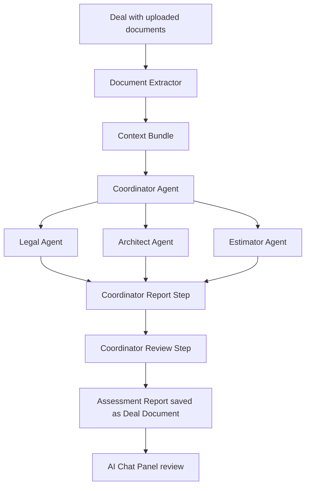

# RFPulse

RFP & Tender Management Platform with a React frontend and PostgreSQL-backed Express API.

## Quick start

1. Install dependencies:
   ```bash
   yarn install
   ```

2. Create a PostgreSQL database:
   ```bash
   createdb rfpulse
   ```

3. Copy the environment file and update it:
   ```bash
   cp .env.example .env
   ```

4. Apply the schema and seed the database:
   ```bash
   psql $DATABASE_URL -f server/schema.sql
   node server/seed.js
   ```

5. Run both the API and the frontend:
   ```bash
   yarn dev:full
   ```

   Or run them separately:
   ```bash
   yarn server:dev   # API on http://localhost:3000
   yarn dev          # Vite on http://localhost:5001
   ```

## Default superadmin

- **Username:** d.sharstabitau
- **Password:** Toriabra909

## AI Processor

RFPulse includes a Coordinator-driven multi-agent AI processor that reads a deal's uploaded documents and generates a submission-ready assessment report.

**Agent roles**
- **Coordinator** — reads the deal context, extracts facts, routes work to specialists, synthesizes their outputs into the final Markdown assessment report, and reviews it for gaps against the original requirements.
- **Legal** — compliance, contractual risks, and governance posture.
- **Architect** — solution design, data model, phased implementation plan.
- **Estimator** — granular Work Breakdown Structure (WBS), effort estimate, team composition, and contingency.
- **UI Developer** *(disabled by default)* — optional prototype scope.

A Superadmin can configure each agent (model, system prompt, temperature, etc.) from the **Agent Management** page.

## Agent Flow



The final report begins with a **Coordinator Review** section that includes a **Confidence Win Score (%)**, a short explanation, and any highlighted gaps or missed requirements from the original deal documents.

## Configuring the AI Processor

1. Sign in as a Superadmin and open **Agent Management**.
2. Paste your OpenAI API key and click **Save**. The key is stored in the `global_settings` table.
3. The default agents are seeded automatically when the list is loaded. To force a prompt/model reset after editing `server/services/aiPrompts.js`, run:
   ```bash
   node server/scripts/resetAgents.js
   ```