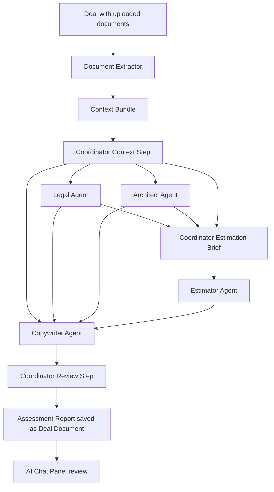

# RFPulse

RFP & Tender Management Platform with a React frontend and PostgreSQL-backed Express API.

## Quick start

1. Install dependencies:
   ```bash
   yarn install
   ```

2. Create a PostgreSQL database:
   ```bash
   createdb rfpulse
   ```

3. Copy the environment file and update it:
   ```bash
   cp .env.example .env
   ```

4. Apply the schema and seed the database. The schema script is non-destructive and preserves existing data:
   ```bash
   yarn db:setup
   yarn db:seed
   ```

5. Run both the API and the frontend:
   ```bash
   yarn dev:full
   ```

   Or run them separately:
   ```bash
   yarn server:dev   # API on http://localhost:3000
   yarn dev          # Vite on http://localhost:5001
   ```

## Default superadmin

- **Username:** d.sharstabitau
- **Password:** Toriabra909

## AI Processor

RFPulse includes a Coordinator-driven multi-agent AI processor that reads a deal's uploaded documents and generates a submission-ready assessment report.

**Agent roles**
- **Coordinator** — reads the deal context, extracts facts, routes work to specialists, synthesizes their outputs into the final Markdown assessment report, and reviews it for gaps against the original requirements.
- **Legal** — compliance, contractual risks, and governance posture.
- **Architect** — solution design, data model, phased implementation plan.
- **Estimator** — granular Work Breakdown Structure (WBS), effort estimate, team composition, and contingency. Runs after Legal and Architect so estimates reflect compliance and architecture findings.
- **Copywriter** — turns the Coordinator context plus specialist outputs into the cohesive assessment report draft.
- **UI Developer** *(disabled by default)* — optional prototype scope.

A Superadmin can configure each agent (model, system prompt, temperature, etc.) from **Platform Configuration → AI Settings**.

## Agent Flow



Legal and Architect run in parallel because they can work from the same Coordinator context. After both complete, the Coordinator creates an estimation brief for the Estimator. The Copywriter then receives the Coordinator context plus Legal, Architect, and Estimator outputs and drafts the final assessment report before Coordinator review.

The final report begins with a **Coordinator Review** section that includes a **Confidence Win Score (%)**, a short explanation, and any highlighted gaps or missed requirements from the original deal documents.

Agent workflow progress is persisted per deal in `ai_workflow_steps`. The table records each major step, its status, artifacts, and errors so interrupted flows can resume with saved context instead of starting from scratch. The deal AI workspace also includes a clear-history action that removes the conversation, coordinator context, and saved agent artifacts after user confirmation; generated documents are kept.

When Execute AI proposes deal property updates, generated deal descriptions are Markdown so they render cleanly on the deal page.

Deals also include **AI Notes**, a separate field directly below the description. These notes are appended directly to every relevant agent's system prompt as highest-priority deal-owner instructions, while also remaining visible in the deal context. Each Execute AI run starts a fresh session so cached specialist outputs cannot bypass updated notes; editing notes in a live session invalidates its derived outputs.

## Configuring the AI Processor

1. Sign in as a Superadmin and open **Platform Configuration → AI Settings**.
2. Paste your OpenAI API key and click **Save**. The key is stored in the `global_settings` table.
3. The default agents are seeded automatically when the list is loaded. To force a prompt/model reset after editing `server/services/aiPrompts.js`, run:
   ```bash
   node server/scripts/resetAgents.js
   ```

## Platform Configuration

Superadmins use **Platform Configuration** for admin-only setup:

- **User Management**: create, update, and delete users.
- **AI Settings**: configure the OpenAI key and agent model settings.
- **CMS**: add, rename, and delete deal statuses and domains. Existing deal values are automatically added to CMS options, deal forms and filters read these options dynamically, and renaming an option updates deals that use it. Options currently used by deals cannot be deleted.

Editors and Superadmins can update deal properties directly on the deal detail page by clicking the displayed value. Viewers remain read-only.

## Deploying on Render.com

This repository includes a Render Blueprint in `render.yaml`. The Blueprint creates:

- One Node.js web service for the Express API and built React/Vite frontend.
- One Render PostgreSQL database.
- One persistent disk mounted at `/var/data` for uploaded deal documents and AI-generated Markdown reports.

The production server serves `/api/*` from Express and serves the built frontend from `dist/` for all other routes.

### One-click Blueprint deploy

1. Push this repository to GitHub.
2. In Render, open **Blueprints** and create a new Blueprint from the repository.
3. Render will detect `render.yaml` and create the `rfpulse` web service plus `rfpulse-db` PostgreSQL database.
4. Review the generated settings, then apply the Blueprint.

The Blueprint uses these commands:

```bash
npm run render:build      # installs dependencies and builds the frontend
npm run render:predeploy  # applies schema/migrations and seeds the default superadmin
npm run render:start      # starts the production Express server
```

### Environment variables

`render.yaml` configures the required production variables:

- `DATABASE_URL` is injected from the Render PostgreSQL database.
- `JWT_SECRET` is generated by Render.
- `NODE_ENV=production`.
- `UPLOAD_DIR=/var/data/uploads`, backed by the persistent disk.

Do not set `VITE_API_URL` for the Blueprint deployment. The frontend and API are served from the same Render service, so browser requests to `/api` work without extra configuration.

The OpenAI API key is not stored as a Render environment variable. After deployment, sign in as a Superadmin, open **Platform Configuration → AI Settings**, paste the key, and save it. The app stores it in the database and uses it to load available models.

### Manual Render deploy

If you prefer not to use the Blueprint:

1. Create a Render PostgreSQL database.
2. Create a Render Node.js web service connected to this repository.
3. Set these commands:
   ```bash
   Build Command: npm run render:build
   Pre-Deploy Command: npm run render:predeploy
   Start Command: npm run render:start
   ```
4. Add environment variables:
   ```bash
   DATABASE_URL=<your Render PostgreSQL internal connection string>
   JWT_SECRET=<a strong random string>
   NODE_ENV=production
   UPLOAD_DIR=/var/data/uploads
   ```
5. Add a persistent disk mounted at `/var/data`.
6. Set the health check path to `/api/health`.

### First login

After the first deploy finishes, sign in with the default Superadmin:

- **Username:** d.sharstabitau
- **Password:** Toriabra909

Change the default password from the profile page immediately after first login.

### Production notes

- The database setup script is idempotent and preserves existing deals.
- The seed script preserves an existing Superadmin password on later deploys.
- Uploaded documents require persistent storage. Without the Render disk, files may disappear when the service restarts.
- Render persistent disks require a paid web service plan and are available only at runtime. The Blueprint uses the `starter` web plan and a 5 GB disk.
- Render's free PostgreSQL plan is suitable for trials only. For production, upgrade the database plan before relying on it for long-term storage.
