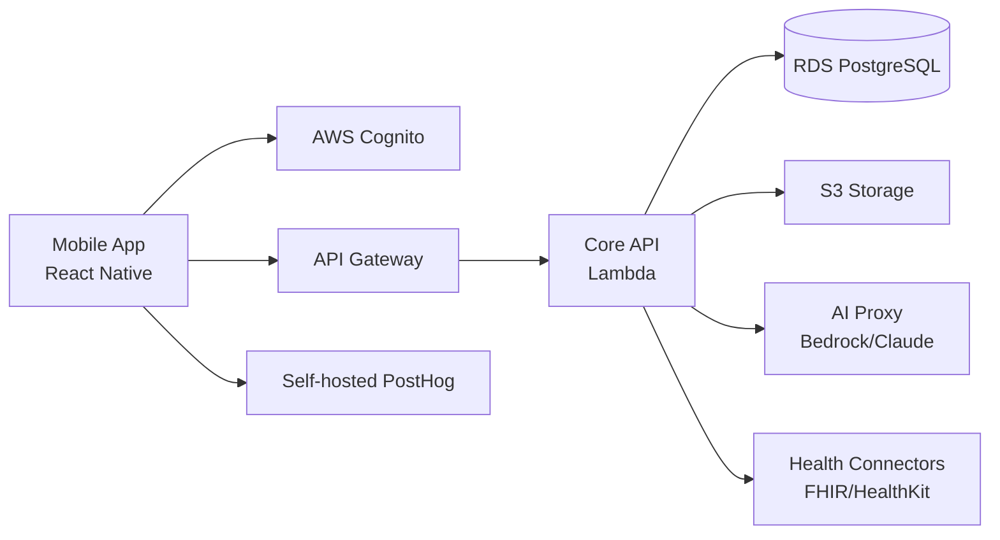

# Assessment Report: Medavize MVE Mobile App

## 1. Executive Summary

Medavize is seeking a HIPAA-compliant mobile MVE that empowers patients and caregivers to collect health data, generate AI-driven insights, and prepare for doctor visits. The RFP targets a <3-month delivery timeline with all work performed inside Medavize's AWS environment.

We propose a serverless, AWS-native mobile health platform using React Native, AWS Lambda, RDS PostgreSQL, S3, and Claude via AWS Bedrock with a de-identification proxy. The MVE includes patient/caregiver enrollment, multi-source health data ingestion, AI-powered insights, doctor visit prep, subscription billing, and Apple/Google app store launch.

**Key capabilities**
- Patient and caregiver enrollment with email/phone validation and Google/Apple SSO
- Health data ingestion from EHRs, Apple Health, Google Health, manual entry, documents, audio, text, and scanned records
- AI insights via Claude with a prompt framework, humanoid visual, and drill-down findings
- Doctor visit preparation: summary, questions, medication list, sharing, and visit recording summary
- Subscription model (1-month free), analytics, and app store launch

**High-level timeline:** <3 months • **Team:** 4.5 FTE core • **Total effort:** ~1,560 hours (plus 15% contingency)

---

## 2. Compliance Posture

- **Governance**
  - Business Associate Agreement (BAA) with AWS and any PHI subprocessors.
  - Lightweight security and compliance review before app store launch.
  - Risk register maintained throughout the engagement.
- **Data Residency**
  - All data stored in Medavize's AWS account; region selected based on user base (e.g., `us-east-1`).
- **Privacy & Consent**
  - Consent tracking for data collection, AI processing, and analytics.
  - User data export and deletion flows.
- **HIPAA specifics**
  - ePHI scope includes health records, vitals, EHR data, audio, and scanned documents.
  - Encryption at rest and in transit; no PHI in logs, metrics, crash reports, or notifications.
  - PHI separation between application data, audit logs, and analytics events.
- **Security Controls**
  - KMS encryption, least-privilege IAM, Cognito MFA, device revocation.
  - VPC, private subnets, WAF, CloudFront for web assets.
  - Immutable audit logs for PHI access and admin actions.

---

## 3. Technology Stack & Architecture

- **Mobile**: React Native (Expo) for iOS and Android.
- **Backend**: AWS API Gateway + Lambda (Node.js/TypeScript).
- **Auth**: AWS Cognito with email/phone and Google/Apple SSO.
- **Data**: RDS PostgreSQL (TLS/KMS) for structured data; S3 SSE-KMS for documents, audio, and scans.
- **Real-time/AI**: Lambda AI proxy → AWS Bedrock/Claude; de-identification before model calls.
- **Health connectors**: FHIR/HealthKit APIs for EHR, Apple Health, and Google Health.
- **Document/audio processing**: AWS Textract for OCR, Transcribe for audio.
- **Analytics**: Self-hosted PostHog with PHI-free event dictionary.
- **CI/CD**: EAS/Bitrise for mobile builds; AWS-native IaC.

**Data flow summary**
1. Mobile app → API Gateway → Lambda → RDS/S3
2. Health data → FHIR/HealthKit connectors → normalized store
3. AI insights → AI proxy (de-identification) → Bedrock/Claude → returned summary

### Architecture Diagram

---

## 4. Data Residency & Tenancy

- All data remains within Medavize's AWS account.
- Single-tenant deployment for the MVE; multi-tenancy can be added in later phases if needed.
- Backups encrypted and retained in the same region.

---

## 5. Security Controls (Detailed)

- **Access control**: RBAC for patient, caregiver, and admin roles; attribute checks at API and SQL layer.
- **Audit logging**: immutable logs for PHI read/write, consent changes, and admin actions.
- **Key management**: AWS KMS with customer-managed keys and rotation.
- **Device security**: encrypted local store, biometric/PIN gate, jailbreak/root detection hooks.
- **SDLC**: SAST/DAST, dependency scanning, secrets scanning, signed releases, IaC policies.

---

## 6. AI & Recommendation Engine

- Health data is de-identified before being sent to Claude via AWS Bedrock.
- Pre-defined prompt framework ensures consistent, simple, and actionable insights.
- Safety guardrails: disclaimers, scope limits, no medical advice, human-in-the-loop for critical outputs.
- Full audit trace of AI inputs, outputs, and user approvals.

---

## 7. Analytics & Product Insights

- Self-hosted PostHog with an event dictionary that excludes PHI.
- Key funnels: onboarding → first insight → subscription conversion.
- Consent gating for analytics; opt-out honored.

---

## 8. Offline-First Strategy

- Encrypted local SQLite store on the mobile device.
- Background sync when connectivity returns.
- Conflict resolution: last-writer-wins for metadata, timestamped merge for health logs.

---

## 9. Core Data Model (Outline)

- `users` (id, email, phone, roles, auth_provider, created_at)
- `patients` (id, user_id, caregiver_id, consent_state)
- `caregivers` (id, user_id, managed_patient_ids)
- `health_data_sources` (id, patient_id, source_type, connection_status)
- `health_records` (id, patient_id, record_type, payload, encrypted_at_rest)
- `ai_insights` (id, patient_id, prompt_version, de_identified_input, summary, created_at)
- `doctor_visit_summaries` (id, patient_id, medications, questions, recording_url, shared_with)
- `subscriptions` (id, patient_id, plan, status, trial_end_date)
- `audit_events` (id, actor, action, target, timestamp, metadata)

All tables encrypted at rest; API policies enforce role and patient scoping.

---

## 10. Implementation Plan

- **Phase I (Weeks 1-2)**: Discovery, onboarding, Figma review, architecture workshop, AWS baseline.
- **Phase II (Weeks 3-6)**: Auth/enrollment, health data ingestion, core API, database schema.
- **Phase III (Weeks 7-10)**: AI insights engine, doctor visit prep, document/audio pipeline.
- **Phase IV (Weeks 11-12)**: Subscriptions, analytics, app store submission, security hardening, documentation.

---

## 11. Work Breakdown Structure (WBS)

| Task ID | Work Package | Task | Description | Effort (hours) | Assumptions | Dependencies | Confidence |
|---------|--------------|------|-------------|----------------|-------------|--------------|------------|
| 1.1 | Discovery & Onboarding | Kickoff & requirements review | Align on scope, Figma, and success criteria | 16 | Figma wireframes available | SOW signed | High |
| 1.2 | Discovery & Onboarding | Architecture workshop | Define AWS baseline, data model, and security approach | 24 | Stakeholders available | 1.1 | High |
| 1.3 | Discovery & Onboarding | AWS account access & setup | Configure IAM, VPC, billing alerts | 24 | AWS admin access granted | SOW signed | High |
| 1.4 | Discovery & Onboarding | Project scaffolding | Monorepo, CI/CD, linting, dev env | 24 | Tooling choices agreed | 1.3 | High |
| 2.1 | AWS Baseline | VPC & networking | Subnets, NAT, security groups | 24 | AWS admin access | 1.3 | High |
| 2.2 | AWS Baseline | Cognito user pools | Auth config, MFA, Google/Apple SSO | 24 | SSO credentials provided | 2.1 | High |
| 2.3 | AWS Baseline | RDS & S3 provisioning | PostgreSQL, S3 buckets, KMS keys | 24 | Region selected | 2.1 | High |
| 2.4 | AWS Baseline | API Gateway & Lambda baseline | REST API scaffold, logging, IAM roles | 24 | Architecture agreed | 2.3 | High |
| 3.1 | Auth & Enrollment | Sign-up screens | Patient/caregiver registration UI | 24 | Figma designs ready | 1.2 | High |
| 3.2 | Auth & Enrollment | Email/phone validation | Verification flows, retry logic | 24 | SMS provider chosen | 3.1 | High |
| 3.3 | Auth & Enrollment | Google/Apple SSO | Social login integration | 24 | SSO credentials ready | 2.2 | High |
| 3.4 | Auth & Enrollment | Role model & invites | Patient/caregiver linking, permissions | 24 | Roles defined | 3.1 | High |
| 4.1 | Core Backend | DB schema & migrations | Users, patients, records, subscriptions | 24 | Data model finalized | 1.2 | High |
| 4.2 | Core Backend | CRUD API for patients/caregivers | REST endpoints, validation, RBAC | 32 | DB schema ready | 4.1 | High |
| 4.3 | Core Backend | File upload API | Presigned S3 URLs, virus scan hook | 24 | S3 ready | 2.3 | High |
| 4.4 | Core Backend | Audit logging middleware | Log all PHI access | 24 | Audit schema defined | 4.2 | High |
| 5.1 | Health Data Ingestion | Manual vitals entry | Form, validation, storage | 24 | Units/format agreed | 4.2 | High |
| 5.2 | Health Data Ingestion | Apple Health integration | HealthKit SDK, OAuth | 32 | Apple dev account | 3.3 | Medium |
| 5.3 | Health Data Ingestion | Google Health integration | Health Connect SDK | 32 | Google dev account | 3.3 | Medium |
| 5.4 | Health Data Ingestion | EHR connector (FHIR) | SMART on FHIR demo + one consolidator | 40 | Sandboxes available | 2.4 | Medium |
| 5.5 | Health Data Ingestion | Document upload (PDF/Word/images) | S3 upload, metadata extraction | 24 | File size limits agreed | 4.3 | High |
| 5.6 | Health Data Ingestion | Audio upload & storage | Recording UI, S3 upload | 24 | Mic permissions handled | 4.3 | High |
| 6.1 | Document/Audio Pipeline | OCR for scanned documents | AWS Textract integration | 32 | Textract enabled | 5.5 | Medium |
| 6.2 | Document/Audio Pipeline | Audio transcription | AWS Transcribe integration | 32 | Transcribe enabled | 5.6 | Medium |
| 6.3 | Document/Audio Pipeline | Structured data normalization | Extract entities, store in health_records | 32 | Schema stable | 6.1, 6.2 | Medium |
| 7.1 | AI Insights Engine | De-identification proxy | Strip PHI before AI calls | 32 | Data model known | 4.2 | Medium |
| 7.2 | AI Insights Engine | Claude/Bedrock integration | AWS SDK, prompt framework v1 | 32 | Bedrock access | 7.1 | Medium |
| 7.3 | AI Insights Engine | Prompt framework | Template versioning, safety prompts | 32 | Clinical scope agreed | 7.2 | Medium |
| 7.4 | AI Insights Engine | Humanoid visual component | UI for presenting insights | 24 | Figma design | 7.3 | High |
| 7.5 | AI Insights Engine | Drill-down detail view | Show underlying findings | 24 | Figma design | 7.4 | High |
| 8.1 | Doctor Visit Prep | Med list aggregation | Pull current medications from records | 24 | Data sources ready | 5.1 | High |
| 8.2 | Doctor Visit Prep | Summary document generation | PDF/shareable summary | 32 | Template agreed | 8.1 | Medium |
| 8.3 | Doctor Visit Prep | Question builder | Suggested questions based on insights | 32 | AI insights ready | 7.5 | Medium |
| 8.4 | Doctor Visit Prep | Visit recording & summary | In-app recording, transcription, share | 40 | Audio pipeline ready | 6.2, 8.3 | Medium |
| 9.1 | Subscription & Analytics | Subscription model | Trial, monthly/annual plans, status | 32 | Payment provider chosen | 4.2 | Medium |
| 9.2 | Subscription & Analytics | PostHog instrumentation | PHI-free events, dashboards | 24 | PostHog instance | 4.2 | High |
| 9.3 | Subscription & Analytics | Analytics dashboards | Onboarding and retention funnels | 24 | Events defined | 9.2 | High |
| 10.1 | App Store Launch | iOS build & submission | Expo build, privacy manifest, App Store | 40 | Apple developer account | 9.1 | Medium |
| 10.2 | App Store Launch | Android build & submission | Play Console, privacy policy | 32 | Google developer account | 9.1 | Medium |
| 10.3 | App Store Launch | Closed beta / TestFlight | Distribution, feedback loop | 24 | Testers recruited | 10.1 | High |
| 11.1 | QA & Hardening | Unit & integration tests | Core flows, API tests | 32 | Feature code ready | 8.4, 9.1 | High |
| 11.2 | QA & Hardening | Security hardening | Dependency scan, secrets review, WAF tuning | 24 | Security baseline | 10.1 | High |
| 11.3 | QA & Hardening | Bug fixes & polish | MVE bug triage | 40 | UAT feedback | 10.3 | Medium |
| 12.1 | Documentation & Handover | API docs | OpenAPI/specs | 16 | API stable | 4.4 | High |
| 12.2 | Documentation & Handover | Runbooks & architecture doc | Deployment, incident response | 24 | Infra ready | 11.2 | High |
| 12.3 | Documentation & Handover | HIPAA package | Controls list, audit log samples | 24 | Audit logging ready | 11.2 | High |

### Work Package Summary
| Work Package | Total Effort (hours) | Confidence |
|--------------|----------------------|------------|
| Discovery & Onboarding | 88 | High |
| AWS Baseline | 96 | High |
| Auth & Enrollment | 96 | High |
| Core Backend | 104 | High |
| Health Data Ingestion | 176 | Medium |
| Document/Audio Pipeline | 96 | Medium |
| AI Insights Engine | 144 | Medium |
| Doctor Visit Prep | 128 | Medium |
| Subscription & Analytics | 80 | High |
| App Store Launch | 96 | Medium |
| QA & Hardening | 96 | Medium |
| Documentation & Handover | 64 | High |
| **Base Total** | **1,360** | Medium |
| Contingency (15%) | 204 | Medium |
| **Grand Total** | **1,564** | Medium |

---

## 12. Effort & Cost Estimate

**Base effort:** 1,360 hours  
**Contingency (15%):** 204 hours  
**Grand total:** ~1,564 hours  
**Duration:** <3 months with a 4.5 FTE core team

### Basis of Estimate
- Estimate is competitive and lean: every task is capped at 40 hours and scoped to MVE-only functionality.
- Assumes Figma wireframes are ready at kickoff and AWS account access is available within 3 days.
- EHR integration scoped to a single FHIR consolidator sandbox plus Apple/Google Health SDKs to avoid long procurement cycles.
- App store review times are not included in the estimate; contingency covers minor rejection rounds.

---

## 13. Team Composition

| Role | Count / FTE | Responsibilities |
|------|-------------|------------------|
| React Native Engineer | 2 | Mobile UI, enrollment, health insights, visit prep |
| Backend Engineer (Node.js/AWS) | 1 | API, Lambda, integrations, AI proxy |
| DevOps/Security Engineer | 0.5 | AWS baseline, CI/CD, HIPAA controls |
| QA Engineer | 0.5 | Test automation, app store QA |
| Product/Project Manager | 0.5 | Sprint planning, stakeholder sync |
| AI Engineer | 0.5 | Prompt framework, Claude integration |

---

## 14. Hidden Complexity, Dependencies & Contingency

| Hidden Complexity / Dependency | Impact | Contingency / Mitigation |
|--------------------------------|--------|--------------------------|
| EHR sandbox access and legal review | +1-2 weeks | Start with a FHIR consolidator (e.g., 1upHealth) to avoid direct Epic/Cerner contracts |
| Apple/Google Health approval delays | +3-5 days | Use OAuth scopes minimally; prepare privacy policy early |
| App Store medical/health review | +1-2 weeks | Build privacy manifest, no medical claims, early TestFlight |
| HIPAA documentation and client security review | +1 week | Package controls and audit logs during the sprint, not at the end |
| AI hallucination / safety guardrails | +1 week | Human-in-the-loop, prompt versioning, disclaimers, audit trace |
| Scanned document quality / OCR accuracy | +3-5 days | Textract with fallback to manual validation flow |
| Visit recording transcription accuracy | +3-5 days | Transcribe medical vocabulary, allow user edit |
| Third-party subscription/payment provider setup | +3-5 days | Stripe/RevenueCat sandbox early in Phase IV |

---

## 15. Risks & Mitigations

- **EHR access delays** → Mitigated by using consolidators and phased rollout.
- **App store review delays** → Mitigated by early TestFlight/closed beta and privacy compliance checklist.
- **HIPAA audit findings** → Mitigated by built-in controls, documentation, and optional third-party review.
- **AI vendor policy shifts** → Mitigated by de-identification proxy and switchable provider.

---

## 16. Deliverables

- System architecture document
- Data model and API specifications
- Implementation plan and sprint backlog
- MSA/IP assignment clause recommendation
- HIPAA compliance documentation package
- AWS infrastructure as code
- Mobile app builds for iOS and Android
- App store submission artifacts
- Handover documentation and runbooks

---

## 17. Appendices

- **HIPAA control checklist**: encryption, access control, audit logging, PHI separation, BAA coverage.
- **Audit event catalog**: login, consent changes, PHI read/write, AI recommendation issued.
- **Data retention matrix**: health records (per policy), audit logs (12–24 months), analytics (90 days, PHI-free).
