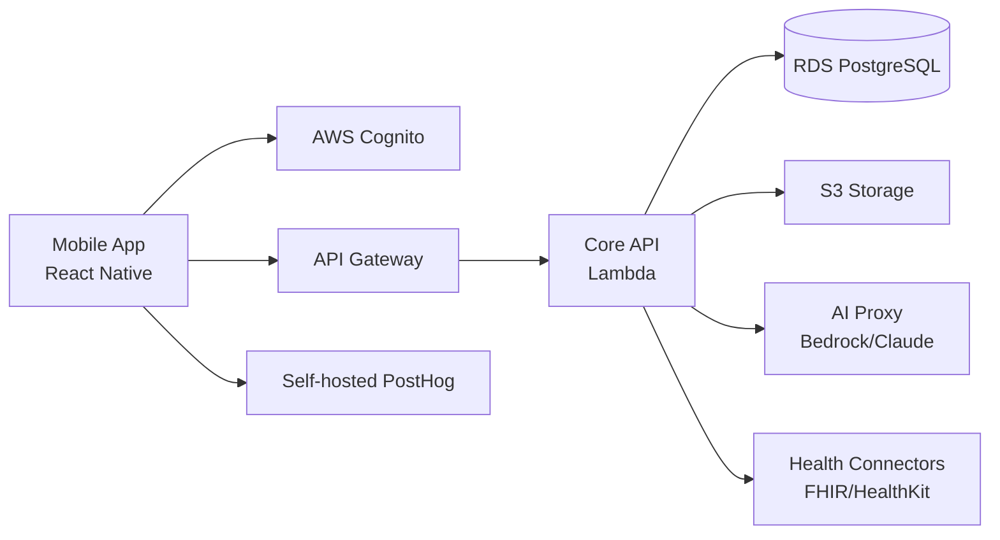

# Assessment Report: Medavize MVE Mobile App

## 1. Executive Summary

Medavize Inc. is seeking a HIPAA-compliant mobile Minimum Viable Experience (MVE) that empowers patients and caregivers to collect health data, generate AI-driven insights, and prepare for doctor visits. The RFP targets a <3-month delivery timeline, with all development hosted inside Medavize’s AWS environment.

We propose a lean, AWS-native, serverless mobile health platform using React Native (Expo), Node.js/TypeScript Lambda APIs, RDS PostgreSQL, S3, and Claude via AWS Bedrock behind a de-identification proxy. The MVE covers patient/caregiver enrollment, multi-source health data ingestion, AI-powered health insights, doctor visit preparation, subscription billing, analytics, and Apple/Google app store launch.

**Key capabilities**
- Patient and caregiver enrollment with email/phone validation and Google/Apple SSO.
- Health data ingestion from EHRs, Apple Health, Google Health, manual entry, documents, audio, text, and scanned records.
- AI insights via Claude using a pre-defined prompt framework, humanoid visual, and drill-down findings.
- Doctor visit preparation: summary, questions, medication list, sharing, and visit recording summary.
- Subscription model (one month free), analytics, and app store launch.

**High-level timeline:** 10–12 weeks  
**Team:** ~5 FTE (blended allocation)  
**Total effort:** 1,500 hours + 10% contingency (150 hours)

## 2. Compliance Posture

- **Governance**
  - Business Associate Agreement (BAA) with AWS and any PHI subprocessors.
  - Lightweight security and compliance review before app store launch.
  - Risk register maintained throughout the engagement.
- **Data Residency**
  - All data stored in Medavize’s AWS account; region selected based on the user base (e.g., `us-east-1`).
  - Single-tenant deployment for the MVE.
- **Privacy & Consent**
  - Consent tracking for data collection, AI processing, and analytics.
  - User data export and deletion flows.
- **HIPAA specifics**
  - ePHI scope includes health records, vitals, EHR data, audio, and scanned documents.
  - Encryption at rest and in transit; no PHI in logs, metrics, crash reports, or notifications.
  - PHI separation between application data, audit logs, and analytics events.
- **Security Controls**
  - KMS encryption, least-privilege IAM, Cognito MFA, device revocation.
  - VPC, private subnets, WAF, CloudFront for web assets.
  - Immutable audit logs for PHI access and admin actions.

## 3. Technology Stack & Architecture

- **Mobile**: React Native (Expo) for iOS and Android.
- **Backend**: AWS API Gateway + Lambda (Node.js/TypeScript).
- **Auth**: AWS Cognito with email/phone and Google/Apple SSO.
- **Data**: RDS PostgreSQL (TLS/KMS) for structured data; S3 SSE-KMS for documents, audio, and scans.
- **Real-time/AI**: Lambda AI proxy → AWS Bedrock/Claude; de-identification before model calls.
- **Health connectors**: FHIR/HealthKit APIs for EHR, Apple Health, and Google Health; EHR consolidator (e.g., 1upHealth) for broad coverage.
- **Document/audio processing**: AWS Textract for OCR, Transcribe for audio.
- **Analytics**: Self-hosted PostHog with PHI-free event dictionary.
- **CI/CD**: EAS/Bitrise for mobile builds; AWS-native IaC.

**Data flow summary**
1. Mobile app → API Gateway → Lambda → RDS/S3.
2. Health data → FHIR/HealthKit connectors → normalized store.
3. AI insights → AI proxy (de-identification) → Bedrock/Claude → returned summary.

### Architecture Diagram

## 4. Data Residency & Tenancy

- All data remains within Medavize’s AWS account.
- Single-tenant deployment for the MVE; multi-tenancy can be added in later phases if needed.
- Backups encrypted and retained in the same region.

## 5. Security Controls (Detailed)

- **Access control**: RBAC for patient, caregiver, and admin roles; attribute checks at API and SQL layer.
- **Audit logging**: immutable logs for PHI read/write, consent changes, and admin actions.
- **Key management**: AWS KMS with customer-managed keys and rotation.
- **Device security**: encrypted local store, biometric/PIN gate, jailbreak/root detection hooks.
- **SDLC**: SAST/DAST, dependency scanning, secrets scanning, signed releases, IaC policies.

## 6. AI & Recommendation Engine

- Health data is de-identified before being sent to Claude via AWS Bedrock.
- Pre-defined prompt framework ensures consistent, simple, and actionable insights.
- Safety guardrails: disclaimers, scope limits, no medical advice, human-in-the-loop for critical outputs.
- Full audit trace of AI inputs, outputs, and user approvals.

## 7. Analytics & Product Insights

- Self-hosted PostHog with an event dictionary that excludes PHI.
- Key funnels: onboarding → first insight → subscription conversion.
- Consent gating for analytics; opt-out honored.

## 8. Offline-First Strategy

- Encrypted local SQLite store on the mobile device.
- Background sync when connectivity returns.
- Conflict resolution: last-writer-wins for metadata, timestamped merge for health logs.

## 9. Core Data Model (Outline)

- `users` (id, email, phone, roles, auth_provider, created_at)
- `patients` (id, user_id, caregiver_id, consent_state)
- `caregivers` (id, user_id, managed_patient_ids)
- `health_data_sources` (id, patient_id, source_type, connection_status)
- `health_records` (id, patient_id, record_type, payload, encrypted_at_rest)
- `ai_insights` (id, patient_id, prompt_version, de_identified_input, summary, created_at)
- `doctor_visit_summaries` (id, patient_id, medications, questions, recording_url, shared_with)
- `subscriptions` (id, patient_id, plan, status, trial_end_date)
- `audit_events` (id, actor, action, target, timestamp, metadata)

All tables encrypted at rest; API policies enforce role and patient scoping.

## 10. Implementation Plan

- **Phase I (Weeks 1–2)**: Discovery, onboarding, Figma review, architecture workshop, AWS baseline, security design.
- **Phase II (Weeks 3–5)**: Auth/enrollment, core API, database schema, health data ingestion core (manual entry, documents, Apple/Google Health).
- **Phase III (Weeks 6–8)**: AI insights engine, doctor visit prep, EHR connector, document/audio pipeline.
- **Phase IV (Weeks 9–10)**: Subscriptions, analytics, offline sync, security hardening, documentation.
- **Phase V (Weeks 11–12)**: QA, TestFlight/closed beta, app store submission, post-launch bug fix buffer, handover.

**Dependencies & sequencing risks**: EHR/1upHealth sandbox access and Apple/Google SSO credentials must be available by Week 3 to avoid delaying Phase II. App store review cycles are scheduled in Phase V with a built-in buffer.

## 11. Work Breakdown Structure (WBS)

| Task ID | Work Package | Task | Description | Effort (hours) | Assumptions | Dependencies | Confidence |
|---------|--------------|------|-------------|----------------|-------------|--------------|------------|
| A1 | Project Onboarding | Kickoff & alignment | Stakeholder kickoff, scope confirmation, sprint cadence | 8 | Figma and requirements available | — | High |
| A2 | Project Onboarding | Requirements review | Walk through RFP, Figma, and acceptance criteria | 16 | Wireframes cover all MVE screens | Figma provided | High |
| A3 | Project Onboarding | AWS access & tooling | Obtain credentials, set up access, repositories | 16 | Medavize provides AWS accounts and IAM | — | Medium |
| A4 | Project Onboarding | JIRA/board setup | Configure backlog, workflows, dashboards | 8 | Tooling decision made (client or vendor JIRA) | — | High |
| A5 | Project Onboarding | HIPAA risk register | Identify PHI risks, BAA review, controls list | 16 | Legal/compliance review feedback within 2 days | — | Medium |
| A6 | Project Onboarding | Weekly PM syncs | Stand-ups, sprint planning, stakeholder updates | 16 | 12-week project; 1h/week overhead | — | High |
| B1 | Design & Architecture | Architecture workshop | Define components, data flow, security model | 16 | Key stakeholders available | AWS access | High |
| B2 | Design & Architecture | Data model design | Core entities, relationships, PHI separation | 16 | Requirements review complete | B1 | High |
| B3 | Design & Architecture | API & FHIR mapping | API contracts, FHIR resource mapping, endpoints | 24 | EHR integration approach selected | B2 | Medium |
| B4 | Design & Architecture | AI prompt framework | Prompt templates, guardrails, version strategy | 16 | Claude/Bedrock access confirmed | B1 | Medium |
| B5 | Design & Architecture | Figma-to-UI mapping | Screen inventory, component list, navigation | 16 | Figma contains final MVE screens | A2 | High |
| B6 | Design & Architecture | Offline sync design | Local store, sync, conflict resolution approach | 16 | React Native/Expo chosen | B1 | High |
| B7 | Design & Architecture | Security & compliance review | HIPAA controls, encryption, audit design | 16 | Risk register complete | B1, B2 | Medium |
| C1 | AWS Baseline | VPC & IAM baseline | Networking, roles, least-privilege policies | 16 | AWS environment ready | A3 | Medium |
| C2 | AWS Baseline | RDS provisioning | Encrypted PostgreSQL, backups, parameter groups | 16 | VPC complete | C1 | High |
| C3 | AWS Baseline | S3 & KMS setup | Buckets, key policies, lifecycle, encryption | 8 | C1 complete | C1 | High |
| C4 | AWS Baseline | Cognito & MFA | User pools, identity providers, MFA | 16 | Google/Apple SSO credentials ready | C1 | Medium |
| C5 | AWS Baseline | WAF & CloudFront | Edge config, security groups, monitoring | 16 | C1 complete | C1 | Medium |
| C6 | AWS Baseline | CI/CD & IaC baseline | GitHub Actions / EAS / Bitrise + Terraform | 8 | Repo structure decided | C1 | High |
| D1 | Backend & API | Project scaffolding | Lambda, API Gateway, TypeScript setup | 16 | C1, C2, C3 | High |
| D2 | Backend & API | Core middleware & auth | Auth middleware, logging, error handling | 24 | C4 complete | C4 | High |
| D3 | Backend & API | Patient/caregiver APIs | Profiles, roles, linking | 24 | B2, D2 | High |
| D4 | Backend & API | Health record APIs | CRUD, encryption, S3 references | 24 | B2, C3 | High |
| D5 | Backend & API | Document upload pipeline | S3 upload, pre-signed URLs, validation | 16 | C3, D2 | High |
| D6 | Backend & API | Audit logging service | Immutable audit events for PHI access | 16 | B7 | Medium |
| D7 | Backend & API | Background job processing | Queue for OCR/transcription/summarization | 24 | C3, D5 | Medium |
| D8 | Backend & API | API integration tests | End-to-end tests for critical flows | 24 | D3, D4, D5 | High |
| D9 | Backend & API | API documentation | OpenAPI spec, developer docs | 16 | D8 | High |
| D10 | Backend & API | Security hardening | Dependency scan, secrets review, WAF tuning | 16 | B7, D8 | Medium |
| E1 | Auth & Enrollment | Cognito SSO integration | Google/Apple federated sign-in | 24 | C4, SSO credentials | Medium |
| E2 | Auth & Enrollment | Patient enrollment flow | Email/phone validation, password setup | 24 | E1, B5 | High |
| E3 | Auth & Enrollment | Caregiver enrollment & linking | Caregiver invite, patient linking | 24 | E2, D3 | High |
| E4 | Auth & Enrollment | RBAC & attribute checks | Role-based access in API and UI | 16 | B7, D2 | High |
| E5 | Auth & Enrollment | Profile & account security | Password reset, MFA, device revocation | 16 | E1 | High |
| E6 | Auth & Enrollment | Auth integration tests | Sign-in flows, RBAC tests | 16 | E2, E3 | High |
| F1 | Health Data Ingestion | Apple Health integration | HealthKit read, permissions, normalization | 32 | iOS device/testing environment | B6, D4 | Medium |
| F2 | Health Data Ingestion | Google Health Connect integration | Health Connect read, permissions, normalization | 32 | Android device/testing environment | B6, D4 | Medium |
| F3 | Health Data Ingestion | EHR consolidator connector | 1upHealth/FHIR integration, auth, mapping | 40 | EHR access / sandbox credentials | B3, D2 | Low |
| F4 | Health Data Ingestion | Manual vitals entry | UI forms, validation, storage | 16 | B5 | High |
| F5 | Health Data Ingestion | Document upload & normalization | Word/PDF/spreadsheet parsing to structured records | 24 | D5, D7 | Medium |
| F6 | Health Data Ingestion | OCR pipeline | Textract integration, image preprocessing | 24 | C3, D7 | Medium |
| F7 | Health Data Ingestion | Audio ingestion & transcription | Transcribe integration, audio storage | 24 | C3, D7 | Medium |
| F8 | Health Data Ingestion | Manual scan capture | Camera capture, cropping, OCR feed | 16 | F6, B5 | Medium |
| F9 | Health Data Ingestion | Data normalization engine | Convert all inputs to canonical health record model | 24 | F1–F8 design | High |
| F10 | Health Data Ingestion | Data source management UI | Connect/disconnect sources, status, consent | 24 | B5, E4 | High |
| F11 | Health Data Ingestion | Cross-source integration tests | Validate ingestion flows, edge cases | 32 | F1–F10 | Medium |
| F12 | Health Data Ingestion | PHI separation & privacy checks | Ensure no PHI in logs, analytics, notifications | 16 | B7, D6 | Medium |
| G1 | AI Insights Engine | AI proxy & de-identification | Strip/replace PHI before model calls | 24 | B4, D2 | Medium |
| G2 | AI Insights Engine | Claude/Bedrock integration | Model invocation, retries, quotas | 24 | B4, G1 | Medium |
| G3 | AI Insights Engine | Prompt framework implementation | Templates, versioning, parameterization | 24 | B4, G2 | High |
| G4 | AI Insights Engine | Humanoid visual component | Animated/illustrated health avatar | 24 | B5, G3 | Medium |
| G5 | AI Insights Engine | Drill-down insight screens | Detail views, explanations, sources | 24 | G3, B5 | High |
| G6 | AI Insights Engine | Safety guardrails & disclaimers | Scope limits, medical advice disclaimers | 16 | G3, B4 | High |
| G7 | AI Insights Engine | AI audit logging & traceability | Log inputs/outputs, approvals, versions | 16 | D6, G2 | High |
| G8 | AI Insights Engine | AI integration testing | Guardrails, accuracy, regression tests | 8 | G3–G7 | Medium |
| H1 | Doctor Visit Prep | Visit summary generation | Aggregate latest insights into summary doc | 24 | G3, D4 | High |
| H2 | Doctor Visit Prep | Questions & meds generation | AI-generated questions and medication list | 24 | G3, D4 | High |
| H3 | Doctor Visit Prep | Share document flow | Doctor/caregiver sharing, permissions | 16 | E4, H1, H2 | High |
| H4 | Doctor Visit Prep | Visit recording capture | Audio recording during visit (with consent) | 24 | B5, F7 | Medium |
| H5 | Doctor Visit Prep | Visit recording summarization | AI summary of conversation | 24 | G3, H4 | Medium |
| H6 | Doctor Visit Prep | Visit prep UI | Screens for prep, summary, share | 8 | B5, H1–H3 | High |
| I1 | Subscription & Analytics | Subscription status service | Trial, monthly/annual status, entitlements | 16 | B2, D3 | Medium |
| I2 | Subscription & Analytics | Subscription UI & paywall | Mobile screens, purchase restore | 16 | B5, I1 | Medium |
| I3 | Subscription & Analytics | PostHog analytics integration | Event dictionary, funnels, dashboards | 16 | B5, B7 | Medium |
| I4 | Subscription & Analytics | Analytics consent gating | Opt-in/out, PHI-free filtering | 12 | E4, I3 | High |
| J1 | Mobile App | RN/Expo project setup | Navigation, theming, build config | 16 | B5 | High |
| J2 | Mobile App | Shared UI component library | Buttons, cards, inputs, lists | 24 | B5, J1 | High |
| J3 | Mobile App | Figma-to-dev implementation | Pixel-perfect screen builds | 40 | B5, J2 | Medium |
| J4 | Mobile App | Enrollment screens | Patient/caregiver flows | 16 | E2, E3, J2 | High |
| J5 | Mobile App | Health data dashboard | Sources, records, status | 24 | F10, J2 | High |
| J6 | Mobile App | AI insights screens | Humanoid visual, drill-down | 24 | G4, G5, J2 | High |
| J7 | Mobile App | Doctor visit prep screens | Summary, questions, meds, share | 24 | H6, J2 | High |
| J8 | Mobile App | Subscription & settings screens | Paywall, account, consent | 16 | I2, I4, J2 | High |
| J9 | Mobile App | Offline storage & sync | Encrypted SQLite, sync, conflict | 24 | B6, J2 | Medium |
| J10 | Mobile App | Biometric/PIN gate | Local auth, device security hooks | 16 | E4, J2 | High |
| J11 | Mobile App | Push notifications & deep links | Local alerts, routing | 16 | J1 | Medium |
| J12 | Mobile App | Accessibility & polish | Screen reader, contrast, responsive | 16 | J3–J11 | High |
| J13 | Mobile App | Unit/component tests | Jest/RTL tests | 24 | J2–J12 | High |
| K1 | QA & Launch | Test plan & automation | QA strategy, automated suite | 24 | D8, F11, J13 | High |
| K2 | QA & Launch | QA testing cycles | Functional, regression, HIPAA checks | 32 | All feature tasks | Medium |
| K3 | QA & Launch | TestFlight/closed beta | iOS/Android beta distribution | 16 | J12, K2 | Medium |
| K4 | QA & Launch | App store submission | Assets, privacy labels, review | 24 | K3 | Medium |
| K5 | QA & Launch | Post-launch bug fix buffer | Triage & fix production issues | 24 | K4 | Medium |
| L1 | Documentation & Handover | Architecture & data model docs | Diagrams, decisions, runbooks | 16 | B1, B2 | High |
| L2 | Documentation & Handover | Deployment & runbooks | Build, deploy, incident response | 16 | C6, D9 | High |
| L3 | Documentation & Handover | API documentation | OpenAPI, usage examples | 8 | D9 | High |
| L4 | Documentation & Handover | HIPAA compliance package | Controls matrix, evidence, BAA | 16 | B7, D6 | Medium |
| L5 | Documentation & Handover | Knowledge transfer | Demo, walkthrough, Q&A | 4 | K4 | High |

### Work Package Summary

| Work Package | Total Effort (hours) | Confidence |
|--------------|----------------------|------------|
| Project Onboarding | 80 | High |
| Design & Architecture | 120 | High |
| AWS Baseline | 80 | Medium |
| Backend & API | 200 | High |
| Auth & Enrollment | 120 | High |
| Health Data Ingestion | 300 | Medium |
| AI Insights Engine | 160 | Medium |
| Doctor Visit Prep | 120 | High |
| Subscription & Analytics | 60 | Medium |
| Mobile App | 280 | Medium |
| QA & Launch | 120 | Medium |
| Documentation & Handover | 60 | High |
| **Subtotal** | **1,500** | — |
| **Contingency (10%)** | **150** | — |
| **Total with Contingency** | **1,650** | — |

## 12. Effort & Cost Estimate

- **Total Effort:** 1,500 hours (excluding contingency)
- **Recommended Contingency:** 10% (150 hours) to cover integration and app store risks.
- **Estimated Duration:** 10–12 weeks with the recommended blended team.

### Basis of Estimate

The 1,500-hour estimate is built from the granular WBS above and reflects a lean, competitive MVE approach. It assumes:
- Medavize provides finalized Figma wireframes and requirements by Week 1.
- Medavize provides AWS account access, IAM roles, and Google/Apple SSO credentials by Week 2.
- EHR access is delivered through a FHIR consolidator (e.g., 1upHealth) rather than direct Epic/Cerner integrations.
- Apple and Google developer accounts are available for app store submission.
- Bedrock/Claude is enabled in the selected AWS region.
- One month of post-launch bug-fix support is included; extended support is out of scope.

The estimate excludes separate commercial rate-based pricing, sample MSA drafting, formal SOC 2 certification, and direct EHR integrations beyond the consolidator. These can be provided as optional add-ons.

### Hidden Complexity, Dependencies & Exclusions

| Risk / Dependency | Impact | Exclusion / Mitigation |
|-------------------|--------|------------------------|
| EHR/1upHealth sandbox access delays | Could push Phase II by 1–2 weeks | Use FHIR consolidators; fall back to manual entry/CSV import |
| App store review or privacy rejections | Launch delay of 1–3 weeks | Early TestFlight, privacy nutrition labels, closed beta |
| HIPAA documentation & formal audit readiness | Extra 40–80 hours if a formal audit is required | Pre-built control matrix; optional third-party review excluded |
| AI model accuracy & safety guardrails | Additional prompting/testing overhead | Human-in-the-loop, disclaimer, limited MVE scope |
| Apple Health / Google Health version fragmentation | Additional platform testing | Use Expo Health plugins; test on representative devices |
| Real-time visit recording summarization | Audio quality affects accuracy | On-device recording with user consent, post-processing summary |
| Figma changes after Week 2 | Rework and estimate growth | Change-control process; major redesigns treated as change orders |

## 13. Team Composition

| Role | Count / FTE | Responsibilities |
|------|-------------|------------------|
| React Native Engineer | 2 | Mobile UI, enrollment, health data, AI insights, visit prep, app store builds |
| Backend Engineer (Node.js/AWS) | 1 | API, Lambda, integrations, AI proxy, data pipeline |
| DevOps/Security Engineer | 0.5 | AWS baseline, CI/CD, HIPAA controls, security hardening |
| QA Engineer | 0.5 | Test automation, regression, app store QA |
| Product/Project Manager | 0.5 | Sprint planning, stakeholder sync, backlog management |
| AI Engineer | 0.5 | Prompt framework, Claude integration, AI guardrails |

**Notes**: The team is ~5 FTE blended, but not all roles are full-time for the entire 12 weeks. React Native and Backend engineers are full-time; DevOps, QA, PM, and AI are allocated part-time where their input is most needed. This keeps the team lean while preserving coverage.

## 14. Risks & Mitigations

- **EHR access delays** → Mitigated by using consolidators (e.g., 1upHealth) and a phased rollout with manual entry as a fallback.
- **App store review delays** → Mitigated by early TestFlight/closed beta and a privacy compliance checklist.
- **HIPAA audit findings** → Mitigated by built-in controls, documentation, and an optional third-party review (not included in base estimate).
- **AI vendor policy shifts** → Mitigated by de-identification proxy and switchable provider backend.
- **Scope creep from Figma changes** → Mitigated by a Week 2 design freeze and a formal change-control process.
- **Real-time audio summary accuracy** → Mitigated by on-device recording, clear consent, and a post-processing summary with user edit capability.

## 15. Deliverables

- System architecture document with Mermaid diagrams.
- Data model and API specifications (OpenAPI).
- Implementation plan and sprint backlog.
- WBS and effort estimate.
- MSA/IP assignment clause recommendation (sample MSA provided separately on request).
- HIPAA compliance documentation package.
- AWS infrastructure as code.
- Mobile app builds for iOS and Android.
- App store submission artifacts and privacy labels.
- Handover documentation and runbooks.
- Post-launch bug-fix support for one month.

## 16. Appendices

- **HIPAA control checklist**: encryption, access control, audit logging, PHI separation, BAA coverage.
- **Audit event catalog**: login, consent changes, PHI read/write, AI recommendation issued, subscription events.
- **Data retention matrix**: health records (per policy), audit logs (12–24 months), analytics (90 days, PHI-free).
- **RFP response notes**: Commercial pricing, sample MSA, similar work samples, and augmented-team rates will be supplied in a separate commercial proposal package. AI expertise and EHR integration experience are described in Sections 6 and 3 respectively.
