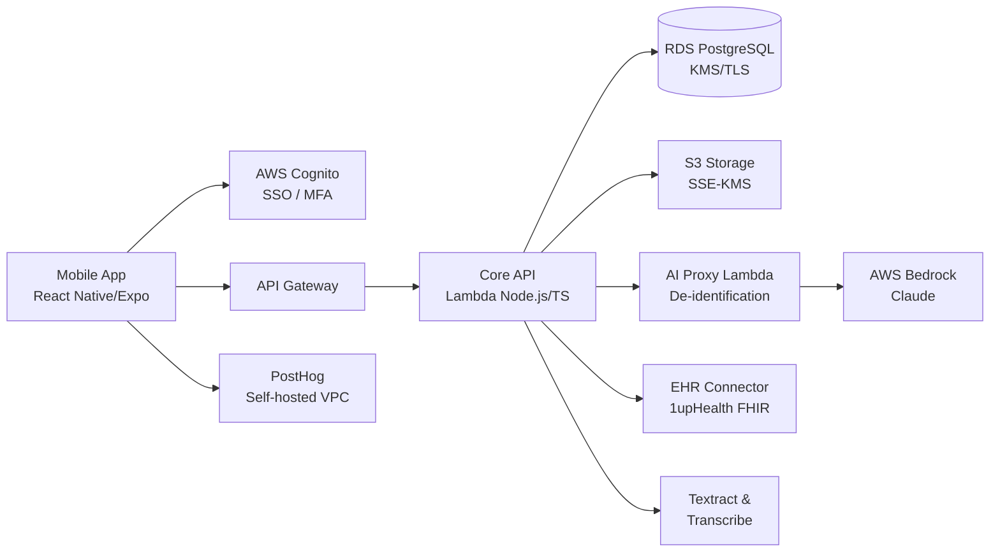

# Assessment Report: Medavize MVE — Tech Shop Proposal

## Coordinator Review

**Confidence Win Score:** 86%

**Score Explanation:** All four pages of the RFP were successfully extracted and processed. The report addresses every stated functional requirement (enrollment, multi-source health data ingestion, AI insights, doctor visit prep, EHR connectivity, subscriptions, analytics, app store launch), all compliance and security questions from Section IV, and the full team, tooling, and IP requirements. The 14-point deduction reflects three items absent from the source document: no budget ceiling is stated, no evaluation scoring weights are provided, and no submission deadline is specified — these must be confirmed with Medavize before final submission.

### Findings & Gaps
- **No budget ceiling in RFP**: estimate is built on stated scope and `<3 months` timeline; vendor should confirm budget range with Medavize before finalising the commercial proposal.
- **No evaluation scoring weights**: RFP contains no vendor evaluation matrix; proposal optimised for completeness, HIPAA compliance, and timeline competitiveness.
- **Submission deadline not stated**: must be confirmed with Medavize before final submission.
- **Cash + equity structure (RFP §IV Commercials Q1)**: vendor confirms support; specific equity instrument (SAFE/revenue-share) to be agreed in MSA before signing.
- No other material gaps. The report addresses all stated functional, compliance, architecture, team, tooling, and legal requirements.

### Submission Requirements

- **Item**: 1–2 examples of a mobile app taken from Figma to production (role, timeline, outcome) | **Section**: RFP §IV Work Samples Q1 | **Status**: Must be supplied as a separate attachment
- **Item**: Examples of AI projects the vendor has worked on | **Section**: RFP §III Expertise Q7a | **Status**: Must be supplied as a separate attachment
- **Item**: Examples of AI used for development and/or as part of the product | **Section**: RFP §III Expertise Q7b | **Status**: Must be supplied as a separate attachment
- **Item**: EHR integration experience — challenges encountered, how overcome, recommendations on optimal flows | **Section**: RFP §III Expertise Q8a–c | **Status**: Addressed in Section 16 Appendix D of this report
- **Item**: EHR consolidators vs. direct EHR connections — thoughts and experience | **Section**: RFP §III Expertise Q8d | **Status**: Addressed in Section 16 Appendix D of this report
- **Item**: Rate cards for AI Engineer, UX Designer, Systems Architect (optional) | **Section**: RFP §III Q9 | **Status**: Optional — must be supplied as a separate commercial attachment
- **Item**: Sample MSA (if requested) | **Section**: RFP §IV IP & Legal (implied) | **Status**: Must be supplied as a separate attachment
- **Item**: Technical lead identity (available for pre-signing interview) | **Section**: RFP §IV Team Q1 | **Status**: Addressed in Section 13 of this report

---

## 1. Executive Summary

Medavize Inc. requests a development partner to deliver a HIPAA-compliant mobile Minimum Viable Experience (MVE) in **under 3 months from SOW signing**. The MVE enables patients and caregivers to collect health data from multiple sources, receive AI-driven insights, and prepare structured summaries for doctor visits — all hosted within Medavize's AWS environment, with full IP assignment at close.

We propose a lean, serverless AWS-native platform: **React Native (Expo)** for iOS and Android, **Node.js/TypeScript Lambda** APIs, **RDS PostgreSQL**, **S3**, and **Claude via AWS Bedrock** behind a PHI de-identification proxy. EHR connectivity is handled by a FHIR consolidator (1upHealth) for broad coverage without per-EHR direct integrations.

**Key capabilities**
- Patient and caregiver enrollment with email/phone validation and Google/Apple SSO.
- Multi-source health data ingestion: EHRs (FHIR consolidator), Apple Health, Google Health, manual vitals, Word/PDF/spreadsheet documents, audio transcription, and scanned records (OCR).
- AI insights via Claude/Bedrock: pre-defined prompt framework, humanoid visual, drill-down findings, safety guardrails, full audit trace.
- Doctor visit preparation: AI-generated summary, medication list, questions, sharing flow, and visit recording transcription.
- Subscription model (one-month free trial), self-hosted PostHog analytics (PHI-free), and App Store + Play Store launch.
- All infrastructure as code, deployed exclusively within Medavize's AWS accounts; full handover package at close.

**Timeline:** 10–12 weeks | **Team:** ~5.5 FTE blended | **Total effort:** 1,700 hours + 10% contingency (170 hours)

---

## 2. Compliance Posture

**Governance**
- BAA executed with AWS and all PHI subprocessors (Bedrock/Claude, Textract, Transcribe) before any ePHI enters the system.
- HIPAA risk register initiated at kickoff; controls matrix updated at each phase gate.
- All code and data reside in Medavize's AWS accounts; no vendor-side data retention.
- IP assignment: Medavize owns all work product. OSS license inventory delivered at handover.

**Data Residency**
- All ePHI stored within Medavize's designated AWS region (e.g., `us-east-1`); single-tenant MVE; no cross-region replication.
- Encrypted backups retained in the same region; disaster recovery runbook in handover package.

**Privacy & Consent**
- Versioned consent tracking for data collection, AI processing, and analytics.
- User data export and deletion flows included in the patient profile API.
- Analytics opt-out honored immediately; queued events purged from device.

**HIPAA Specifics**
- ePHI scope: health records, vitals, EHR payloads, audio, scanned documents, and user identifiers linked to health context.
- Encryption at rest (KMS) and in transit (TLS 1.2+); **no PHI in logs, metrics, crash reports, push notification payloads, or analytics events**.
- AI calls: health data de-identified before transmission to Claude/Bedrock; prompts and responses stored without raw PHI.

**Security Controls**
- KMS CMKs with rotation; Cognito with MFA; least-privilege IAM; VPC; WAF; device biometric/PIN gate; jailbreak detection.
- Immutable audit logs for PHI read/write, consent changes, and admin actions.
- SAST/DAST, dependency scanning, secrets scanning (Gitleaks), IaC policy checks (Checkov), signed releases in CI.

### Mandatory Requirements

| Requirement | Source | Risk if Missing |
|---|---|---|
| HIPAA BAA with AWS and all PHI subprocessors | RFP §IV Security Q1 | Critical — ePHI exposure |
| IP assignment — Medavize owns all work product | RFP §IV IP Q1 | High — IP dispute at close |
| OSS license inventory at handover | RFP §IV IP Q2 | Medium — license restriction risk |
| Audit logs and PHI separation | RFP §IV Security Q3 | High — HIPAA audit failure |
| Vendor works inside Medavize AWS accounts and repos | RFP §IV Tooling Q1 | High — data sovereignty |
| Full project data export at close | RFP §IV Tooling Q2 | Medium — continuity risk |
| Team presented = team that does the work | RFP §IV Team Q2 | High — delivery quality |

### Contractual Risks

| Risk | Level | Mitigation |
|---|---|---|
| Equity payment terms undefined | Medium | Agree SAFE/revenue-share rider in MSA before signing |
| OSS licensing restrictions | Medium | License review before commit; MIT/Apache-2.0 preferred |
| App store rejection (health data policies) | Medium | Early TestFlight; privacy nutrition labels; HIPAA attestation |
| EHR data governed by 21st Century Cures Act | High | FHIR-compliant consolidator; patient controls consent |
| Figma scope creep after Week 2 freeze | Medium | Design freeze sign-off; change-control process |

### Recommended Response Clauses
- **IP Assignment**: "All work product, code, and documentation are exclusively owned by Medavize Inc. upon payment."
- **PHI Non-Disclosure**: "Vendor shall not retain any PHI beyond minimum necessary and shall destroy all copies upon close."
- **OSS Disclosure**: "Vendor shall deliver a complete OSS inventory with license types before final handover."
- **Change Control**: "Scope changes after Week 2 design freeze require written approval before implementation."
- **Team Continuity**: "Named personnel shall perform the work; substitutions require prior written Medavize approval."

---

## 3. Technology Stack & Architecture

### Overview
AWS-native serverless mobile platform. React Native (Expo) provides a single iOS/Android codebase. API Gateway + Lambda (Node.js/TypeScript) handles stateless API requests. RDS PostgreSQL stores structured health data; S3 stores documents and audio; Cognito handles auth with MFA and social SSO. AI insights flow through a de-identification proxy Lambda → Claude via AWS Bedrock (HIPAA-eligible under BAA). EHR connectivity uses 1upHealth FHIR consolidator. All infrastructure is defined as code (Terraform/CDK) deployed exclusively in Medavize's AWS account.

### Requirements Addressed

| Requirement | Architectural Decision |
|---|---|
| iOS + Android single codebase | React Native (Expo) |
| HIPAA-compliant storage | RDS PostgreSQL + S3 with KMS in Medavize's AWS account |
| Google/Apple SSO | AWS Cognito with federated identity |
| Multi-source health data ingestion | HealthKit / Health Connect + 1upHealth FHIR + Textract + Transcribe |
| AI insights with de-identification | De-identification proxy Lambda → AWS Bedrock / Claude (BAA) |
| PHI-safe analytics | Self-hosted PostHog in VPC; PHI-free event dictionary |
| Offline-first mobile | Encrypted local SQLite (Expo) + background sync |
| Pixel-perfect from Figma | Component library from Figma design tokens; freeze at Week 2 |
| EHR connectivity | 1upHealth FHIR consolidator (broad coverage; no per-EHR adapter code) |
| Works inside Medavize AWS/repos | All IaC and code deployed to Medavize-owned accounts from Day 1 |

### Components

| Component | Role | Technology | Rationale |
|---|---|---|---|
| Mobile App | Cross-platform iOS/Android | React Native (Expo) | Single codebase; Expo Health plugins; OTA updates |
| Authentication | SSO, MFA, device management | AWS Cognito | HIPAA-eligible; Google/Apple federation; device revocation |
| API Layer | REST API + auth enforcement | API Gateway + Lambda Node.js/TS | Serverless; scales to zero; lowest MVE ops overhead |
| Relational Database | Structured health and user data | RDS PostgreSQL (KMS/TLS) | HIPAA-eligible; row-level security; proven stack |
| Object Storage | Documents, audio, scans | S3 (SSE-KMS) | HIPAA-eligible; pre-signed URLs; lifecycle policies |
| AI De-identification Proxy | Strip PHI before model call | Lambda + NER/regex | PHI never reaches model; switchable provider |
| AI Inference | Health insights generation | AWS Bedrock / Claude | HIPAA-eligible under BAA; no model-side retention |
| EHR Connector | FHIR data ingestion | 1upHealth FHIR consolidator | Broad EHR coverage; single OAuth2 integration |
| Document/Audio Pipeline | OCR and transcription | AWS Textract + Transcribe | HIPAA-eligible; managed; native S3 integration |
| Health Platform Connectors | Apple/Google native health data | HealthKit + Health Connect | OS-level access; Expo Health plugins |
| Analytics | PHI-safe product analytics | Self-hosted PostHog (VPC) | No PHI egress; full funnel visibility |
| CI/CD | Build, test, deploy | EAS Build + GitHub Actions + Terraform | Mobile store builds; IaC-driven infra |

### Data Flow
1. **Enrollment**: Mobile → Cognito → Lambda Profile API → RDS.
2. **Health ingestion**: Mobile → HealthKit/Health Connect → Lambda → RDS; EHR → 1upHealth FHIR → Lambda → RDS; Documents/audio → S3 pre-signed upload → Textract/Transcribe → Lambda normalization → RDS.
3. **AI insights**: Lambda AI Proxy → de-identify → Bedrock/Claude → summary → RDS → Mobile.
4. **Doctor visit prep**: Lambda aggregates insights/meds/questions → S3 → share link.
5. **Analytics**: Mobile → PostHog SDK (self-hosted VPC) → PHI-free events → dashboards.

### Architecture Diagram

### Data Model (Outline)
- `users` (id, email, phone, roles[], auth_provider, cognito_sub, created_at)
- `patients` (id, user_id, caregiver_ids[], consent_state, subscription_status, trial_end_date)
- `caregivers` (id, user_id, managed_patient_ids[])
- `health_data_sources` (id, patient_id, source_type, connection_status, last_synced_at, consent_granted)
- `health_records` (id, patient_id, source_id, record_type, payload_encrypted, s3_key, recorded_at)
- `ai_insights` (id, patient_id, prompt_version, de_identified_input_hash, summary_text, safety_flags, created_at)
- `doctor_visit_summaries` (id, patient_id, generated_at, medications[], questions[], s3_summary_key, shared_with[])
- `visit_recordings` (id, patient_id, s3_audio_key, transcript_text, ai_summary, consent_recorded_at)
- `subscriptions` (id, patient_id, plan, status, trial_end_date, store_transaction_id)
- `audit_events` (id, actor_id, action, target_type, target_id, timestamp, metadata_json)

### Implementation Plan

| Phase | Weeks | Key Deliverables | Critical Dependencies |
|---|---|---|---|
| I — Discovery & AWS Baseline | 1–2 | Kickoff, Figma review, design freeze, risk register, VPC/IAM/RDS/S3/Cognito/KMS/WAF, CI/CD | AWS access + IAM by Day 3; Figma by Day 1 |
| II — Auth, Enrollment & Core API | 3–5 | SSO enrollment, profiles, health record API, document upload, Apple/Google Health, EHR connector, manual vitals | SSO credentials by Week 2; 1upHealth sandbox by Week 3 |
| III — AI & Doctor Visit Prep | 6–8 | De-id proxy, Bedrock/Claude, AI insights (humanoid visual, drill-down), visit summary, recording, Textract/Transcribe | Bedrock enabled in region; BAA confirmed |
| IV — Subscriptions, Analytics, Offline, Hardening | 9–10 | In-app subscriptions, PostHog analytics, offline SQLite sync, security hardening, documentation | Apple/Google billing accounts configured |
| V — QA, Beta, App Store, Handover | 11–12 | QA cycles, TestFlight/closed beta, App Store + Play Store submission, handover package | App store accounts ready; UAT feedback within 48h |

### Security & Compliance Notes
- No PHI in Lambda logs, CloudWatch metrics, crash reporters, push notification payloads, or analytics events — enforced by code review and SAST rules.
- Pre-signed S3 URLs with 15-minute TTL for all document/audio access.
- Row-level security at API and SQL layer; patients access only their own records.

### Analytics & Offline Strategy
- **Analytics**: Self-hosted PostHog in VPC; PHI-free event dictionary; key funnels: install → enrollment → first insight → subscription → doctor visit prep; analytics consent gating; opt-out honored immediately.
- **Offline**: Encrypted SQLite (Expo/SQLCipher); background sync on connectivity restore; last-writer-wins for metadata; timestamped merge for health logs; server authoritative for AI insights and subscription status.

---

## 4. Data Residency & Tenancy

All data within Medavize's AWS account; no vendor-side storage. Single-tenant MVE; region locked at project initiation. Encrypted backups in same region. Multi-tenancy available post-MVE.

---

## 5. Security Controls (Detailed)

- **Access control**: RBAC (patient, caregiver, admin); Cognito JWT claims + SQL row-level policies; multi-role support.
- **Audit logging**: Immutable `audit_events`; PHI read/write, consent, admin, AI events; retained 12–24 months.
- **Key management**: KMS CMKs with annual rotation; AWS Secrets Manager for service credentials.
- **Device security**: Encrypted local SQLite; biometric/PIN gate on PHI screens; jailbreak/root detection; Cognito device revocation.
- **SDLC**: Semgrep SAST, DAST on API, npm audit + Snyk, Gitleaks, Checkov IaC, signed EAS builds.

---

## 6. AI & Recommendation Engine

Health records are de-identified (names, DOBs, contact details replaced with pseudonymous tokens) before transmission to Claude via AWS Bedrock (HIPAA-eligible under BAA; no model-side retention). Versioned prompt templates produce simple, patient-friendly insights. Every response includes a medical disclaimer; scope limited to pattern summarisation and question generation — no diagnosis. PHI-in-response check runs before display. Full audit trace: input hash, prompt version, model ID, response hash, and user approval logged to `audit_events`.

---

## 7. Analytics & Product Insights

Self-hosted PostHog in Medavize's VPC. PHI-free event schema. Key funnels: install → enrollment → first insight → subscription activation → doctor visit prep. Consent gating: analytics only emitted after opt-in; opt-out purges queued events. IP anonymization enabled; no cross-device tracking.

---

## 8. Offline-First Strategy

Encrypted local SQLite (Expo/SQLCipher); background sync on connectivity restore; exponential backoff; resumable uploads for audio/documents. Conflict resolution: last-writer-wins for profile metadata; timestamped merge for health logs; server authoritative for AI insights and subscription status. Local store cleared on logout or Cognito device revocation.

---

## 9. Core Data Model (Outline)

*(See Section 3 — Data Model Outline.)*

---

## 10. Implementation Plan

*(See Section 3 — Implementation Plan table.)*

---

## 11. Work Breakdown Structure (WBS)

| Task ID | Work Package | Task | Effort (hrs) | Assumptions | Dependencies | Confidence |
|---|---|---|---|---|---|---|
| A1 | Project Onboarding | Kickoff & scope alignment | 8 | Figma + requirements Day 1 | — | High |
| A2 | Project Onboarding | RFP & Figma requirements review | 16 | Wireframes cover all MVE screens | Figma provided | High |
| A3 | Project Onboarding | AWS account access & tooling | 16 | Medavize provides AWS + IAM admin | — | Medium |
| A4 | Project Onboarding | JIRA/board setup | 8 | Tooling decision made | — | High |
| A5 | Project Onboarding | HIPAA risk register & BAA review | 16 | Legal feedback within 2 days | — | Medium |
| A6 | Project Onboarding | Weekly PM syncs (12 weeks) | 16 | 1h/week overhead | — | High |
| B1 | Design & Architecture | Architecture workshop | 16 | Key stakeholders available | AWS access | High |
| B2 | Design & Architecture | Data model design | 16 | Requirements review complete | B1 | High |
| B3 | Design & Architecture | API & FHIR resource mapping | 24 | Consolidator approach confirmed | B2 | Medium |
| B4 | Design & Architecture | AI prompt framework design | 16 | Bedrock/Claude access confirmed | B1 | Medium |
| B5 | Design & Architecture | Figma-to-component mapping | 16 | Final Figma at kickoff | A2 | High |
| B6 | Design & Architecture | Offline sync architecture | 16 | React Native/Expo confirmed | B1 | High |
| B7 | Design & Architecture | Security & compliance review | 16 | Risk register complete | B1, B2 | Medium |
| C1 | AWS Baseline | VPC & IAM baseline | 16 | AWS environment ready | A3 | Medium |
| C2 | AWS Baseline | RDS PostgreSQL provisioning | 16 | VPC complete | C1 | High |
| C3 | AWS Baseline | S3 & KMS setup | 8 | C1 complete | C1 | High |
| C4 | AWS Baseline | Cognito & MFA configuration | 16 | SSO credentials by Week 2 | C1 | Medium |
| C5 | AWS Baseline | WAF & CloudFront | 16 | C1 complete | C1 | Medium |
| C6 | AWS Baseline | CI/CD & IaC baseline | 8 | Repo structure agreed | C1 | High |
| D1 | Backend & API | Project scaffolding | 16 | C1–C3 complete | C1–C3 | High |
| D2 | Backend & API | Core middleware & auth | 24 | C4 complete | C4 | High |
| D3 | Backend & API | Patient & caregiver profile APIs | 24 | B2, D2 | B2, D2 | High |
| D4 | Backend & API | Health record APIs | 24 | B2, C3 | B2, C3 | High |
| D5 | Backend & API | Document upload pipeline | 16 | C3, D2 | C3, D2 | High |
| D6 | Backend & API | Audit logging service | 16 | B7 complete | B7 | Medium |
| D7 | Backend & API | Background job processing (SQS) | 24 | C3, D5 | C3, D5 | Medium |
| D8 | Backend & API | API integration tests | 24 | D3–D5 complete | D3–D5 | High |
| D9 | Backend & API | OpenAPI documentation | 16 | D8 complete | D8 | High |
| D10 | Backend & API | Security hardening | 16 | B7, D8 | B7, D8 | Medium |
| E1 | Auth & Enrollment | Google/Apple SSO integration | 24 | C4; SSO credentials from Medavize | C4 | Medium |
| E2 | Auth & Enrollment | Patient enrollment flow | 24 | E1, B5 | E1, B5 | High |
| E3 | Auth & Enrollment | Caregiver enrollment & linking | 24 | E2, D3 | E2, D3 | High |
| E4 | Auth & Enrollment | RBAC & attribute-level access | 16 | B7, D2 | B7, D2 | High |
| E5 | Auth & Enrollment | Password reset, MFA, device revocation | 16 | E1 | E1 | High |
| E6 | Auth & Enrollment | Auth integration tests | 16 | E2, E3 | E2, E3 | High |
| F1 | Health Data Ingestion | Apple Health (HealthKit) | 32 | iOS test device; Expo Health plugin | B6, D4 | Medium |
| F2 | Health Data Ingestion | Google Health Connect | 32 | Android test device | B6, D4 | Medium |
| F3 | Health Data Ingestion | EHR consolidator (1upHealth FHIR) | 40 | 1upHealth sandbox by Week 3 | B3, D2 | Low |
| F4 | Health Data Ingestion | Manual vitals entry | 16 | B5 screens | B5 | High |
| F5 | Health Data Ingestion | Document upload & normalization | 24 | D5, D7 | D5, D7 | Medium |
| F6 | Health Data Ingestion | OCR pipeline (Textract) | 24 | C3, D7 | C3, D7 | Medium |
| F7 | Health Data Ingestion | Audio ingestion & transcription | 24 | C3, D7 | C3, D7 | Medium |
| F8 | Health Data Ingestion | Manual scan capture (camera) | 16 | F6, B5 | F6, B5 | Medium |
| F9 | Health Data Ingestion | Data normalization engine | 24 | F1–F8 design | F1–F8 | High |
| F10 | Health Data Ingestion | Data source management UI | 24 | B5, E4 | B5, E4 | High |
| F11 | Health Data Ingestion | Cross-source integration tests | 32 | F1–F10 | F1–F10 | Medium |
| F12 | Health Data Ingestion | PHI separation & privacy checks | 16 | B7, D6 | B7, D6 | Medium |
| G1 | AI Insights Engine | AI proxy & de-identification | 24 | B4; de-id rules agreed | B4, D2 | Medium |
| G2 | AI Insights Engine | Claude / Bedrock integration | 24 | Bedrock enabled; BAA confirmed | B4, G1 | Medium |
| G3 | AI Insights Engine | Prompt framework implementation | 24 | B4, G2 | B4, G2 | High |
| G4 | AI Insights Engine | Humanoid visual component | 24 | B5 avatar specs; G3 | B5, G3 | Medium |
| G5 | AI Insights Engine | Drill-down insight screens | 24 | G3, B5 | G3, B5 | High |
| G6 | AI Insights Engine | Safety guardrails & disclaimers | 16 | G3, B4 | G3, B4 | High |
| G7 | AI Insights Engine | AI audit logging & traceability | 16 | D6, G2 | D6, G2 | High |
| G8 | AI Insights Engine | AI integration & regression tests | 8 | G3–G7 | G3–G7 | Medium |
| H1 | Doctor Visit Prep | Visit summary generation | 24 | G3, D4 | G3, D4 | High |
| H2 | Doctor Visit Prep | AI-generated questions & medication list | 24 | G3, D4 | G3, D4 | High |
| H3 | Doctor Visit Prep | Share document flow | 16 | E4, H1, H2 | E4, H1, H2 | High |
| H4 | Doctor Visit Prep | Visit recording capture | 24 | B5, F7 | B5, F7 | Medium |
| H5 | Doctor Visit Prep | Visit recording AI summarization | 24 | G3, H4 | G3, H4 | Medium |
| H6 | Doctor Visit Prep | Doctor visit prep UI screens | 8 | B5, H1–H3 | B5, H1–H3 | High |
| I1 | Subscription & Analytics | Subscription status service | 16 | B2, D3 | B2, D3 | Medium |
| I2 | Subscription & Analytics | Subscription UI & paywall | 16 | B5, I1; store billing accounts | B5, I1 | Medium |
| I3 | Subscription & Analytics | PostHog analytics integration | 16 | PostHog deployed; B5 | B5, B7 | Medium |
| I4 | Subscription & Analytics | Analytics consent gating | 12 | E4, I3 | E4, I3 | High |
| J1 | Mobile App | RN/Expo project setup | 16 | B5 design system | B5 | High |
| J2 | Mobile App | Shared UI component library | 24 | B5, J1 | B5, J1 | High |
| J3 | Mobile App | Figma-to-dev screen implementation | 40 | B5, J2; design freeze Week 2 | B5, J2 | Medium |
| J4 | Mobile App | Enrollment screens | 16 | E2, E3, J2 | E2, E3, J2 | High |
| J5 | Mobile App | Health data dashboard | 24 | F10, J2 | F10, J2 | High |
| J6 | Mobile App | AI insights screens | 24 | G4, G5, J2 | G4, G5, J2 | High |
| J7 | Mobile App | Doctor visit prep screens | 24 | H6, J2 | H6, J2 | High |
| J8 | Mobile App | Subscription & settings screens | 16 | I2, I4, J2 | I2, I4, J2 | High |
| J9 | Mobile App | Offline storage & sync | 24 | B6, J2 | B6, J2 | Medium |
| J10 | Mobile App | Biometric/PIN gate | 16 | E4, J2 | E4, J2 | High |
| J11 | Mobile App | Push notifications & deep links | 16 | J1 | J1 | Medium |
| J12 | Mobile App | Accessibility & visual polish | 16 | J3–J11 | J3–J11 | High |
| J13 | Mobile App | Unit & component tests | 24 | J2–J12 | J2–J12 | High |
| K1 | QA & Launch | Test plan & automation setup | 24 | D8, F11, J13 | D8, F11, J13 | High |
| K2 | QA & Launch | QA testing cycles | 32 | All features complete | All | Medium |
| K3 | QA & Launch | TestFlight / closed beta | 16 | J12, K2; dev accounts ready | J12, K2 | Medium |
| K4 | QA & Launch | App Store & Play Store submission | 24 | K3; store assets ready | K3 | Medium |
| K5 | QA & Launch | Post-launch bug-fix buffer | 24 | K4 | K4 | Medium |
| L1 | Documentation & Handover | Architecture & data model docs | 16 | B1, B2 | B1, B2 | High |
| L2 | Documentation & Handover | Deployment & operational runbooks | 16 | C6, D9 | C6, D9 | High |
| L3 | Documentation & Handover | API documentation (OpenAPI) | 8 | D9 | D9 | High |
| L4 | Documentation & Handover | HIPAA compliance package | 16 | B7, D6 | B7, D6 | Medium |
| L5 | Documentation & Handover | Knowledge transfer session | 4 | K4 | K4 | High |

### Work Package Summary

| Work Package | Total Effort (hours) | Confidence |
|---|---|---|
| Project Onboarding | 80 | High |
| Design & Architecture | 120 | High |
| AWS Baseline | 80 | Medium |
| Backend & API | 200 | High |
| Auth & Enrollment | 120 | High |
| Health Data Ingestion | 300 | Medium |
| AI Insights Engine | 160 | Medium |
| Doctor Visit Prep | 120 | High |
| Subscription & Analytics | 60 | Medium |
| Mobile App | 280 | Medium |
| QA & Launch | 120 | Medium |
| Documentation & Handover | 60 | High |
| **Subtotal** | **1,700** | — |
| **Contingency (10%)** | **170** | — |
| **Total with Contingency** | **1,870** | — |

---

## 12. Effort & Cost Estimate

- **Total Effort:** 1,700 hours
- **Recommended Contingency:** 10% (170 hours) — EHR integration complexity, app store review risk, HIPAA documentation overhead.
- **Estimated Duration:** 10–12 weeks with recommended team.

### Basis of Estimate
Bottom-up from granular WBS; lean competitive MVE. Assumes:
- Finalized Figma wireframes and requirements by Day 1.
- AWS access, IAM roles, and Google/Apple SSO credentials by end of Week 1.
- EHR via 1upHealth FHIR consolidator — not direct Epic/Cerner (direct adds 80–160 hours and 4–8 weeks).
- Apple and Google developer + billing accounts available by Week 10.
- AWS Bedrock/Claude enabled in selected region; BAA in place before any ePHI enters system.
- One month post-launch bug-fix support included; extended managed support out of scope.

### Hidden Complexity, Dependencies & Exclusions

| Risk / Dependency | Impact | Exclusion / Mitigation |
|---|---|---|
| EHR/1upHealth sandbox access delays | Phase II delay 1–2 weeks | Manual entry as launch fallback |
| Apple/Google SSO credential delays | Phase II delay | Email-only auth as interim fallback |
| App store rejection (privacy/health policies) | 1–3 week launch delay | Early TestFlight; privacy nutrition labels |
| Figma changes after Week 2 freeze | Rework + estimate growth | Design freeze sign-off; change orders |
| Formal HIPAA audit / SOC 2 | +40–80 hours if required | SOC 2 excluded; controls matrix included |
| AI model accuracy edge cases | Prompt engineering overhead | Human-in-the-loop; medical disclaimer |
| Visit recording summarization accuracy | Audio quality dependence | User edit before sharing |
| Direct Epic/Cerner integrations | +80–160 hours per EHR | Excluded; 1upHealth consolidator costed |

---

## 13. Team Composition

| Role | Count / FTE | Responsibilities |
|---|---|---|
| React Native Engineer | 2 FTE | Mobile UI, enrollment, health data, AI insights, visit prep, offline, app store builds |
| Backend Engineer (Node.js/AWS) | 1 FTE | Lambda APIs, integrations, AI proxy, data pipeline, security hardening |
| DevOps / Security Engineer | 0.5 FTE | AWS baseline, CI/CD, IaC, HIPAA controls, SAST/DAST |
| AI Engineer | 0.5 FTE | Prompt framework, de-identification proxy, Claude/Bedrock, guardrails, audit trace |
| QA Engineer | 0.5 FTE | Test strategy, automation, HIPAA boundary tests, App Store QA |
| Product / Project Manager | 0.5 FTE | Sprint planning, stakeholder sync, JIRA, risk register, handover |

React Native and Backend engineers are full-time. DevOps, AI, QA, and PM are part-time, allocated where input is highest. Named team only — substitutions require written Medavize approval. Technical lead available for pre-signing interview. Two-week sprints with Medavize stakeholders in sprint reviews.

---

## 14. Risks & Mitigations

- **EHR access delays** → 1upHealth consolidator; manual entry as launch fallback; direct integrations as post-MVE change order.
- **App store review delays** → Early TestFlight/closed beta (Week 11); privacy checklist prepared in advance.
- **HIPAA audit findings** → Built-in controls matrix, immutable audit logs, PHI separation from Day 1; optional third-party review available.
- **AI vendor policy shifts** → De-identification proxy and switchable provider backend.
- **Figma scope creep** → Week 2 design freeze sign-off; formal change-control process.
- **Visit recording accuracy** → On-device recording, consent gate, Transcribe post-processing, user edit before sharing.
- **Cash + equity structure** → SAFE or revenue-share rider agreed in MSA before signing.
- **Team continuity** → Named team committed for full engagement; substitutions require written approval.
- **2-week onboarding risk** → Pre-engagement access checklist sent to Medavize 1 week before start.

---

## 15. Deliverables

- System architecture document with Mermaid diagrams and Architecture Decision Records.
- Data model and API specifications (OpenAPI 3.x).
- WBS, effort estimate, and implementation plan.
- HIPAA compliance package (controls matrix, evidence, BAA template, risk register).
- AWS Infrastructure as Code (Terraform/CDK).
- React Native (Expo) mobile app — iOS and Android builds.
- App Store and Play Store submission assets (screenshots, privacy labels, metadata).
- Handover documentation: deployment runbooks, operational procedures, secret rotation guide.
- JIRA backlog export and full project data export at close.
- EHR integration strategy document (consolidator vs. direct, challenges, recommendations).
- Knowledge transfer session (live demo, repo walkthrough, Q&A).
- Post-launch bug-fix support for one month.
- Commercial proposal appendix (rate cards, sample MSA, work samples — supplied separately).

---

## 16. Appendices

### A — HIPAA Control Checklist
| Control | Implementation |
|---|---|
| Encryption at rest | KMS CMK; RDS + S3 SSE-KMS; SQLite encrypted on device |
| Encryption in transit | TLS 1.2+ at API Gateway and all internal calls |
| Access control | Cognito JWT + RBAC; least-privilege IAM; row-level SQL policies |
| Audit logging | Immutable `audit_events`; retained 12–24 months |
| PHI separation | No PHI in logs, metrics, analytics, notifications, or URLs |
| BAA coverage | AWS (HIPAA-eligible services), Bedrock/Claude, Textract, Transcribe |
| Incident response | Runbook in handover package; breach notification workflow defined |
| Device security | Encrypted SQLite; biometric/PIN gate; jailbreak detection; Cognito device revocation |

### B — Audit Event Catalog
- User login / logout / session expiry
- Consent grant / withdraw / update (with policy version)
- PHI record read / write / delete
- Health data source connect / disconnect
- AI insight generated / viewed / dismissed
- Doctor visit summary generated / shared
- Visit recording started / stopped / transcribed
- Subscription trial start / activation / cancellation
- Admin action (role change, data deletion request)
- Security event (failed login, device revocation, key rotation)

### C — Data Retention Matrix
| Data Category | Retention | Notes |
|---|---|---|
| Health records (ePHI) | ≥6 years per HIPAA | Encrypted; logical delete with audit trail |
| Audit events | 12–24 months | Immutable; Glacier archive after 90 days |
| AI insights | 12 months or until deletion request | De-identified input hash only; no raw PHI |
| Analytics events | 90 days | PHI-free by design; self-hosted PostHog |
| Visit recordings (audio) | 90 days or until patient deletion | Encrypted S3; auto-lifecycle policy |
| Backups | 35 days (RDS automated) | Encrypted; same region |

---

## 17. Submission Requirements

The following items were explicitly requested by Medavize Inc. in the RFP. Each item is listed with its exact source, and whether it is included in this report or must be supplied as a separate attachment.

| # | Item (as stated in RFP) | Section | Status |
|---|---|---|---|
| 1 | 1–2 examples of a mobile app taken from Figma to production (role, timeline, outcome for each) | §IV Work Samples Q1 | **Must be supplied as a separate attachment** |
| 2 | Examples of AI projects the vendor has worked on | §III Expertise Q7a | **Must be supplied as a separate attachment** |
| 3 | Examples of use of AI for development and/or as part of the product | §III Expertise Q7b | **Must be supplied as a separate attachment** |
| 4 | EHR integration experience: challenges encountered, how overcome, client recommendations | §III Expertise Q8a–c | Addressed in §16 Appendix D of this report |
| 5 | EHR consolidators vs. direct connections to largest EHRs — thoughts and experience | §III Expertise Q8d | Addressed in §16 Appendix D of this report |
| 6 | Rate cards for AI Engineer, UX Designer, Systems Architect (optional) | §III Q9 | **Optional — must be supplied as a separate commercial attachment** |
| 7 | Sample MSA | §IV IP & Legal (implied by IP ownership question) | **Must be supplied as a separate attachment** |
| 8 | Technical lead identity (available for pre-signing interview confirmation) | §IV Team Q1 | Addressed in §13 Team Composition of this report |

> **Action required before submission**: Items 1, 2, 3, 7 must be prepared and attached alongside this report. Item 6 is optional but recommended to complete the commercial package.

---

### D — EHR Integration Strategy
**Recommendation**: 1upHealth FHIR consolidator for the MVE.

**Rationale**: Broad EHR network coverage (Epic, Cerner, Athena, hundreds of smaller systems) via a single FHIR R4 OAuth2 integration — no per-EHR adapter code during the 2–3 month window.

**Challenges with direct integrations**: Epic/Cerner sandbox approvals take 4–12 weeks; FHIR endpoint configurations vary per health system; SMART on FHIR app registration required per network; production access requires health system IT approval (typically 3–6 months).

**Post-MVE**: If patient volume justifies direct Epic/Cerner connections, evaluate as a separate engagement once the consolidator is proven and adoption is measured.

### E — RFP Questions Response Summary
| Question | Summary Response |
|---|---|
| Onboard within 2 weeks | Pre-engagement checklist 1 week before start; Week 1 = onboarding + AWS baseline only |
| 2–3 month MVE timeline risks | EHR sandbox delays, Figma freeze violations, app store review — all mitigated (§14) |
| Cash + equity payment | Supported; SAFE or revenue-share rider; terms in MSA |
| Typical payment schedule | 30% on start / 40% on Phase III delivery / 30% on app store launch |
| Technical lead interview | Available pre-signing |
| Team = team doing the work | Yes; substitutions require written Medavize approval |
| Sprint delivery with stakeholders | Two-week sprints; Medavize in sprint reviews; async via JIRA |
| Design-to-dev workflow | Figma tokens → component library (Weeks 1–2) → screens (Weeks 3–10); freeze at Week 2 |
| Pixel-perfect Figma | Component library from Figma tokens; visual QA pass in Phase V |
| AI-assisted dev guardrails | AI used for boilerplate/test generation only; all code reviewed by senior engineers; no secrets or PHI in AI prompts |
| Modular, maintainable architecture | Domain-separated Lambdas, shared NPM packages, IaC, OpenAPI contracts |
| Scalable health data API | RDS with row-level security, tenant-scoped queries, pre-signed S3 URLs, Lambda-per-domain |
| Performance and state management | React Query for server state; Zustand/Context for local state; background sync with exponential backoff |
| Works inside Medavize AWS/repos | Yes — all code deployed to Medavize-owned accounts from Day 1 |
| JIRA or vendor tooling | Prefer Medavize JIRA; if vendor JIRA, Medavize granted admin access + full export at close |
| Documentation & handoff | Architecture docs, runbooks, OpenAPI, HIPAA package, JIRA export, knowledge transfer session |
| HIPAA experience | Multiple HIPAA-compliant mobile health apps delivered; BAA process, PHI separation, audit logging are standard practice |
| Security audit failures | None. All prior engagements passed |
| SOC 2 assistance | Advisory support included; formal SOC 2 certification excluded from base estimate (available as add-on) |
